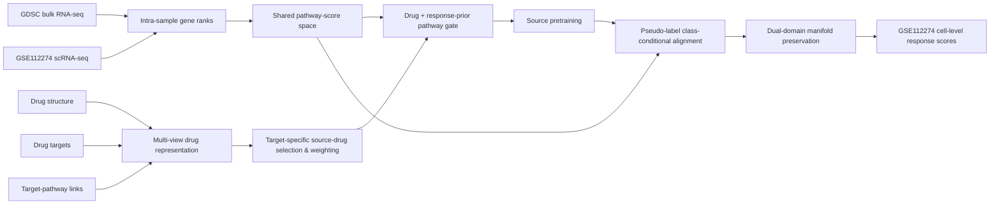

# ChemGuide · GSE112274

**Drug-guided pathway domain adaptation for single-cell drug-response prediction**


ChemGuide is a pathway-level transfer-learning pipeline that connects **bulk pharmacogenomic source data** with **single-cell RNA-seq target data** for drug-response prediction. This repository is a deliberately focused release: it keeps only the **GSE112274 / Gefitinib** target-domain workflow and removes branches for the other single-cell datasets used in the larger study.

The implementation combines an intra-sample rank representation, multi-view drug similarity, drug/response-guided pathway gating, and class-conditional domain adaptation with manifold preservation.

---

## Overview



### Core ideas

**1. Rank-based shared pathway space.** Rather than directly aligning raw bulk and single-cell expression values, each sample is converted to within-sample gene ranks and then summarized at the pathway level. This reduces sensitivity to absolute expression scale, sequencing depth, and platform-specific measurement characteristics.

**2. Multi-view drug-guided transfer.** Drug similarity is computed from three complementary views: molecular structure (MACCS fingerprints), known targets, and target-linked pathway mechanisms. For the fixed target drug **Gefitinib**, the most relevant GDSC source drugs are selected and converted into normalized transfer weights.

**3. Drug- and response-aware pathway gating.** A drug embedding is combined with a sample-specific response prior derived from its similarity to source sensitive/resistant pathway prototypes. The resulting gate dynamically reweights pathways before latent representation learning, allowing the model to condition pathway importance on both the drug and the cell state.

**4. Class-conditional adaptation with structure preservation.** During refinement, high/low-confidence target pseudo-labels define class-specific target subsets. First-order means and second-order covariances are aligned against the corresponding source classes, with source contributions weighted by target-drug similarity. A k-nearest-neighbor manifold regularizer is applied in both source and target domains to discourage destructive geometric distortion during transfer.

> **Scope of this repository.** The larger study may contain broader multi-dataset, temporal, baseline, patient, or wet-lab analyses. This focused repository contains the core model pipeline for **GSE112274 only** and does not present those broader analyses as outputs of this code release.

---

## Repository structure

```text
ChemGuide-GSE112274/
├── README.md
├── run.py
├── requirements.txt
├── .gitignore
├── .github/
│   └── workflows/
│       └── python-check.yml
├── data/
│   └── README.md
├── results/
│   └── .gitkeep
└── src/
    ├── __init__.py
    ├── config.py       # experiment configuration
    ├── data.py         # input loading and label construction
    ├── pathway.py      # intra-sample ranks and pathway scoring
    ├── drug.py         # multi-view drug representation and source selection
    ├── model.py        # drug/response-guided pathway gating network
    ├── losses.py       # weighted CORAL and manifold preservation
    ├── train.py        # source pretraining and target adaptation
    ├── evaluate.py     # GSE112274 evaluation
    └── pipeline.py     # end-to-end orchestration
```

`run.py` is intentionally thin: it imports `main()` from `src.pipeline`, while the scientific components are separated into focused modules. This keeps the public entry point simple without placing the complete method in one large script.

The repository intentionally does **not** include large expression matrices or third-party datasets. Place the required files under `data/` using the layout described in [`data/README.md`](data/README.md).

---

## Code organization

The implementation follows the method itself rather than grouping unrelated utilities into one file. `pathway.py` owns the cross-platform pathway representation; `drug.py` owns molecular/target/pathway views and target-specific transfer weights; `model.py` contains only the neural architecture; `losses.py` isolates the alignment objectives; and `train.py` implements the two-stage learning procedure. `pipeline.py` connects these pieces for the single fixed target domain, GSE112274.

The import flow is deliberately one-directional: configuration and low-level feature modules are imported by training/evaluation code, and only `pipeline.py` orchestrates the complete experiment. This avoids circular dependencies and makes individual components easier to inspect, test, or reuse.

---

## Method

### 1. Intra-sample pathway scoring

For each sample, expression values are transformed into gene ranks. For a pathway containing \(m\) observed genes among \(n\) genes in the sample, the pathway score is based on the mean rank and normalized using its theoretical lower and upper bounds. Bulk and single-cell samples are therefore mapped into a common pathway coordinate system before model training.

Only pathways represented by at least **5 genes** in a domain are considered qualified. The model uses the union of qualified GDSC and GSE112274 pathways; pathways unavailable in one domain receive a neutral pre-standardization value.

### 2. Target-specific drug transfer weights

For each GDSC source drug \(d\) relative to Gefitinib \(t\):

\[
S(d,t)=\alpha S_{structure}+\beta S_{target}+\gamma S_{pathway}
\]

with default weights:

- `alpha = 0.50` for MACCS structural similarity,
- `beta = 0.25` for target-set Jaccard similarity,
- `gamma = 0.25` for pathway-mechanism cosine similarity.

The top **3** source drugs are retained by default and converted to softmax-style transfer weights using temperature `tau = 0.5`.

### 3. Pathway gating

Drug features include:

- 167-bit MACCS fingerprints,
- 9 physicochemical descriptors,
- a low-dimensional target representation obtained with Truncated SVD,
- pathway-level drug-mechanism indicators.

The pathway gate receives the learned drug embedding together with a response-prior term computed from similarity to sensitive and resistant source prototypes. The resulting sample-specific gate modulates pathway scores before encoding.

### 4. Adaptation objective

Training proceeds in two stages:

- **Source pretraining:** binary response learning on the selected GDSC source drugs.
- **Target adaptation/refinement:** source supervision is retained while the target representation is regularized by class-conditional alignment and manifold preservation.

During refinement, the highest and lowest target-score quantiles are used as pseudo-sensitive and pseudo-resistant cells. The class-conditional alignment term matches both latent means and covariance structure, while source samples are weighted according to the selected drug-transfer weights.

The effective refinement objective is:

\[
\mathcal{L}=\mathcal{L}_{BCE}
+\lambda_{align}\mathcal{L}_{class\text{-}align}
+\lambda_{manifold}(\mathcal{L}_{src\text{-}manifold}+\mathcal{L}_{tgt\text{-}manifold})
\]

---

## Installation

Python 3.10+ is recommended.

```bash
git clone <YOUR_GITHUB_REPOSITORY_URL>
cd ChemGuide-GSE112274

python -m venv .venv
source .venv/bin/activate      # Linux/macOS
# .venv\Scripts\activate       # Windows

pip install -r requirements.txt
```

If you manage RDKit through Conda, it is also reasonable to install RDKit in the environment first and then install the remaining Python dependencies.

---

## Data preparation

Create the input structure below:

```text
data/
├── gdsc/
│   ├── gdsc_expr.csv
│   ├── gdsc_sens.csv
│   ├── gdsc_smiles.csv
│   └── gdsc_targets.csv
├── gse112274/
│   ├── GSE112274_expr.csv
│   ├── GSE112274_label.csv
│   ├── target_smiles.csv
│   └── target_targets.csv
└── pathways/
    └── h.all.v2026.1.Hs.symbols.gmt
```

See [`data/README.md`](data/README.md) for column conventions and expected matrix orientation.

---

## Run

From the repository root:

```bash
python run.py --data-dir data --output-dir results/gse112274
```

CUDA is used automatically when available; otherwise the pipeline runs on CPU.

The target domain is intentionally fixed in this release:

```text
Dataset : GSE112274
Drug    : Gefitinib
```

There is no dataset-selection switch because unrelated target-domain branches have been removed rather than merely disabled.

---

## Outputs

A successful run writes:

```text
results/gse112274/
├── metrics.csv
├── predictions.csv
├── source_drug_weights.csv
├── target_pathway_gates.csv
├── pathways.csv
├── model.pt
└── run_config.json
```

`predictions.csv` contains cell-level Gefitinib response scores and retrospective evaluation labels. `source_drug_weights.csv` records the three-view similarity terms, final transfer weights, and which GDSC drugs were selected. `target_pathway_gates.csv` exposes the learned pathway gate for each GSE112274 cell and can be used for downstream interpretation.

### Evaluation note

To preserve the behavior of the supplied research code, the reported binary threshold is selected retrospectively from the target labels using the Youden-J criterion. This threshold is suitable for **evaluation**, not a label-free deployment scenario. The continuous response score is available independently in `predictions.csv`.

---

## Default hyperparameters

| Component | Default |
|---|---:|
| Source sensitive / resistant tails | top 10% / bottom 10% |
| Minimum genes per pathway | 5 |
| Selected source drugs | 3 |
| Drug similarity weights | 0.50 / 0.25 / 0.25 |
| Drug embedding | 32 |
| Hidden dimension | 128 |
| Latent dimension | 64 |
| Dropout | 0.5 |
| Source epochs | 15 |
| Adaptation epochs | 10 |
| Refinement epochs | 10 |
| Pseudo-label quantile | 0.20 |
| Alignment weight | 20.0 |
| Manifold weight | 0.05 |
| Manifold k | 10 |
| Random seed | 1 |

All defaults are collected in the `Config` dataclass in `src/config.py`.

---

## Reproducibility

The code fixes Python, NumPy, and PyTorch random seeds and enables deterministic cuDNN behavior where applicable. The selected pathway set, learned model state, run configuration, target predictions, pathway gates, and source-drug transfer weights are all exported for traceability.

Exact numerical reproduction can still depend on package versions, hardware, and the precise preprocessing/version of the input data.

---

## Citation

If this repository accompanies a manuscript, replace this section with the final article citation and DOI after publication.

```text
Author(s). Title. Journal, Year.
```

---

## Notes

This repository is intended as a compact research implementation for the **GSE112274 / Gefitinib** target-domain experiment. It is not packaged as a clinical decision system, and predicted response scores should be interpreted in the context of the underlying experimental design and validation framework.
